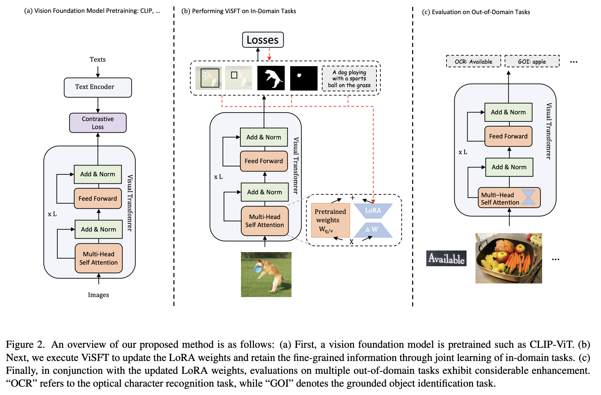

This is the official repo for paper [Supervised Fine-tuning *in turn* Improves Visual Foundation Models](https://arxiv.org/abs/2401.10222).

<div align="center">

📃[**Paper (ArXiv)**](https://arxiv.org/abs/2401.10222) **|** [**Code**](https://github.com/TencentARC/ViSFT/edit/main/README.md) **|** 🤗[**Huggingface**](https://huggingface.co/TencentARC/ViSFT)


</div>

## News
* [2024/01/17] We open source the [ViSFT]() including training scripts and weights. Evaluation codes will be released soon.

## Introduction
Image-text training like CLIP has dominated the pretraining of vision foundation models in recent years. Subsequent efforts have been made to introduce region-level visual learning into CLIP’s pretraining but face scalability challenges due to the lack of large-scale region-level datasets. Drawing inspiration from supervised fine-tuning (SFT) in natural language processing such as instruction tuning, we explore the potential of fine-grained SFT in enhancing the generation of vision foundation models after their pretraining. Thus a two-stage method **ViSFT** (**Vi**sion **SFT**) is proposed to unleash the fine-grained knowledge of vision foun- dation models. In ViSFT, the vision foundation model is enhanced by performing visual joint learning on some in-domain tasks and then tested on out-of-domain benchmarks. With updating using ViSFT on 8 V100 GPUs in less than 2 days, a vision transformer with over 4.4B parameters shows improvements across various out-of-domain benchmarks including vision and vision-linguistic scenarios.



## Installation

### creating a conda environment
```
conda create -n ViSFT python=3.8

conda activate ViSFT
```
### install pytorch
we use torch1.12 with CUDA11.3 on 8 NVIDIA Volta V100- SXM2-32GB GPUs
```
pip install --extra-index-url https://download.pytorch.org/whl/cu113 torch==1.12.0

pip install --extra-index-url https://download.pytorch.org/whl/cu113 torchvision==0.13.0

pip install --extra-index-url https://download.pytorch.org/whl/cu113 torchaudio==0.12.0 
```


### xformers installation

Flash attention is required for running EVA-ViT-E.
please refer to [xformers](https://github.com/facebookresearch/xformers)

### loralib installation

```
pip install --user git+https://github.com/microsoft/LoRA
```

### compile MSDeform for Mask2former head
```
cd ./mmf/models/visft/ops
sudo sh make.sh
# back to root dir
cd ../../../../
```

### other packages installation
```
pip install -r requirements.txt
```

## Dataset Preparation

export DATA_PATH=your_data_path

### image caption
Generating hdf5 files for image caption following [hdf5](https://github.com/sgrvinod/a-PyTorch-Tutorial-to-Image-Captioning/blob/master/create_input_files.py)

file strcture:

```
DATA_PATH/
└── processed_datasets/
    └─── coco_caption_hdf5_files
        ├──TEST_CAPLENS_coco_5_cap_per_img_5_min_word_freq.json
        ├──TEST_CAPTIONS_coco_5_cap_per_img_5_min_word_freq.json
        ├──TEST_IMAGES_coco_5_cap_per_img_5_min_word_freq.hdf5
        ├──TRAIN_CAPLENS_coco_5_cap_per_img_5_min_word_freq.json
        ├──TRAIN_CAPTIONS_coco_5_cap_per_img_5_min_word_freq.json
        ├──TRAIN_IMAGES_coco_5_cap_per_img_5_min_word_freq.hdf5
        ├──VAL_CAPLENS_coco_5_cap_per_img_5_min_word_freq.json
        ├──VAL_CAPTIONS_coco_5_cap_per_img_5_min_word_freq.json
        ├──VAL_IMAGES_coco_5_cap_per_img_5_min_word_freq.hdf5
        └───WORDMAP_coco_5_cap_per_img_5_min_word_freq.json
```
### detection & segmentation

file strcture:

```
DATA_PATH/
└── public_datasets/
    └─── coco
        ├──train2017
        ├──val2017
        ├──test2017
        └───annotations
            ├──instances_train2017.json
            ├──instances_val2017.json
            └───image_info_test-dev2017.json
```

## Training
### Stage1
To get compatible in-domain task heads. Using 8 NVIDIA Volta V100-SXM2-32GB GPUs for every in-domain task head.

**For eva-vit-g**

Preparing weights from [LAVIS](https://github.com/salesforce/LAVIS)
```
wget https://storage.googleapis.com/sfr-vision-language-research/LAVIS/models/BLIP2/eva_vit_g.pth
```
Adding your weights path to configs under dir:./projects/visft/configs/stage1/eva_g/
```
backbone_dir: path/eva_vit_g.pth
```
Implementing training
```
# can be executed in parallel
bash ./scripts/stage1_train/eva_g/caption.sh
bash ./scripts/stage1_train/eva_g/detection.sh
bash ./scripts/stage1_train/eva_g/segment.sh
```

**For eva-vit-e**

Preparing EVA-CLIP weights from [EVA](https://huggingface.co/QuanSun/EVA-CLIP/blob/main/EVA02_CLIP_E_psz14_plus_s9B.pt)

Extract ViT weights
```
python ./scripts/preprocess/extract_eva_e_vit.py
```
Adding your weights path to configs under dir:./projects/visft/configs/stage1/eva_e/
```
backbone_dir: path/EVA02_CLIP_E_psz14_plus_s9B_Visual.pt
```
Implementing training
```
# can be executed in parallel
bash ./scripts/stage1_train/eva_e/caption.sh
bash ./scripts/stage1_train/eva_e/detection.sh
bash ./scripts/stage1_train/eva_e/segment.sh
```

Or you can use the weights we provided.

| In-domain Heads  |           | | 
|----------|:-------------:|:-------------:|
| |       EVA-G     |  EVA-E|
| Caption Head |  [weights](https://huggingface.co/TencentARC/ViSFT/blob/main/eva_g_caption_heads.ckpt) | [weights](https://huggingface.co/TencentARC/ViSFT/blob/main/eva_e_caption_heads.ckpt)|
| Segment Head |    [weights](https://huggingface.co/TencentARC/ViSFT/blob/main/eva_g_segment_heads.ckpt)   |[weights](https://huggingface.co/TencentARC/ViSFT/blob/main/eva_e_segment_heads.ckpt)|
| Detection Head | [weights](https://huggingface.co/TencentARC/ViSFT/blob/main/eva_g_detection_heads.ckpt) |[weights](https://huggingface.co/TencentARC/ViSFT/blob/main/eva_e_detection_heads.ckpt)|


### Stage2

**For eva-vit-g**

Adding your weights path to configs under dir:./projects/visft/configs/stage2/eva_g/stage2.yaml
```
backbone_dir: path/eva_vit_g.pth
caption_ckpt_path: 'path/eva_g_caption_heads.ckpt'
segment_ckpt_path:'path/eva_g_segment_heads.ckpt'
detection_ckpt_path: 'path/eva_g_detection_heads.ckpt'
```
Implementing training
```
bash ./scripts/stage2_train/eva_g/stage2.sh
```

**For eva-vit-e**

Adding your weights path to configs under dir:./projects/visft/configs/stage2/eva_e/stage2.yaml
```
backbone_dir: path/EVA02_CLIP_E_psz14_plus_s9B_Visual.pt
caption_ckpt_path: 'path/eva_e_caption_heads.ckpt'
segment_ckpt_path:'path/eva_e_segment_heads.ckpt'
detection_ckpt_path: 'path/eva_e_detection_heads.ckpt'
```
Implementing training
```
bash ./scripts/stage2_train/eva_e/stage2.sh
```
### Get LoRA Weights
You can extract expected LoRA weights by

```
python ./scripts/postprocess/extract_lora_weights.py
```

Or use the LoRA weights we provide:
| LoRA weights |           | | 
|----------|:-------------:|:-------------:|
|  Iters|     EVA-G     |  EVA-E|
| 5k |  [weights](https://huggingface.co/TencentARC/ViSFT/blob/main/eva_g_lora_5000.pt) | [weights](https://huggingface.co/TencentARC/ViSFT/blob/main/eva_e_lora_5000.pt)|
| 10k |    [weights](https://huggingface.co/TencentARC/ViSFT/blob/main/eva_g_lora_10000.pt)   |[weights](https://huggingface.co/TencentARC/ViSFT/blob/main/eva_e_lora_10000.pt)|
| 15k |    [weights](https://huggingface.co/TencentARC/ViSFT/blob/main/eva_g_lora_15000.pt)   |[weights](https://huggingface.co/TencentARC/ViSFT/blob/main/eva_e_lora_15000.pt)|
| 20k |    [weights](https://huggingface.co/TencentARC/ViSFT/blob/main/eva_g_lora_20000.pt)   |[weights](https://huggingface.co/TencentARC/ViSFT/blob/main/eva_e_lora_20000.pt)|
| 50k | [weights](https://huggingface.co/TencentARC/ViSFT/blob/main/eva_g_lora_50000.pt) |[weights](https://huggingface.co/TencentARC/ViSFT/blob/main/eva_e_lora_50000.pt)|
## Evaluation Benchmarks
- [] Zero-shot Image Classification
- [] Zero-shot Image-text Retrieval
- [] OCR
- [] Grounded Object Indentification
- [] VQA
- [] Image Captioning on NoCaps

## Acknowledgement
The code of ViSFT is based on the official implementation of [mmf](https://github.com/facebookresearch/mmf), [EVA](https://github.com/baaivision/EVA/tree/master) and [LAVIS](https://github.com/salesforce/LAVIS/tree/main)

## Citation


